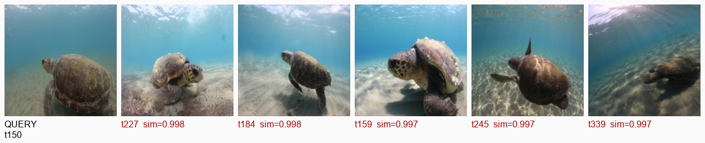

WildTrack — Sea Turtle Individual Re-ID (Training, Evaluation & Retrieval Demo)

Camera-trap/field photos → who is this turtle?
This repo trains a compact classifier + embedding head for individual re-identification (Re-ID) on [SeaTurtleID2022], and ships an evaluation & visualization step that produces retrieval panels (query + top-K matches), t-SNE, and metrics.json.

What you get

model.keras / model.h5 — classifier with an L2-normalized embedding head

preprocessor.pkl — image size, label maps, and configs needed at inference time

model_config.yaml — backbone, embed dim, training knobs

metrics.json — R@K and mAP on a query/gallery split

Plots & assets:

tsne.png — 2-D projection of gallery embeddings

retrieval_example_*.png — query + top-5 gallery results

gradcam_*.png — (optional) heatmaps if a conv layer is present

Dataset

SeaTurtleID2022 (Kaggle) — cropped turtle faces/plates with IDs for Re-ID.

Your local path (from your messages):
C:\Users\sagni\Downloads\WildTrack\archive\turtles-data\data

Folder shape (example):

turtles-data/
  data/
    ID_0001/
      img001.jpg
      img002.jpg
      ...
    ID_0002/
      ...
    ...

The evaluator keeps only IDs with ≥ 2 images (one used as query; remaining as gallery).

Quick start (Windows paths)

1) Create env & install:

# (Recommended) Python 3.10–3.11
pip install -U tensorflow==2.15.* keras==2.15.*  # or TF 2.16/2.17 if you prefer
pip install scikit-learn matplotlib pillow pandas numpy
# Optional for faster indexing:
pip install faiss-cpu

2) Put artifacts here (produced by your training step):

C:\Users\sagni\Downloads\WildTrack\
  model.keras         (or model.h5)
  preprocessor.pkl
  model_config.yaml

3) Run evaluation & visualization:

python evaluate_reid_and_visualize.py

That script will:

read your dataset at
C:\Users\sagni\Downloads\WildTrack\archive\turtles-data\data

load model.keras (or fallback to model.h5)

create a per-ID query/gallery split

extract embeddings and compute R@1/5/10, mAP

save assets into
C:\Users\sagni\Downloads\WildTrack\

Outputs you should see:

metrics.json
tsne.png
retrieval_example_0.png, retrieval_example_1.png, ...
gradcam_0.png, gradcam_1.png, ...  (if conv layer found)

How the model is used for Re-ID

We reuse the classifier’s penultimate embedding (e.g., 256-D), then L2-normalize it.

At query time: embedding(q) · embedding(gallery)^T → cosine similarity → rank.

Exact layer wiring is handled in the script; it prefers a L2Normalize layer if present, otherwise it grabs the tensor feeding softmax and normalizes it.

Configuration knobs

preprocessor.pkl (created during training) typically stores:

image_size (e.g., (224, 224))

embed_dim (e.g., 256)

use_l2norm (bool)

label2id / id2label maps

model_config.yaml captures the backbone and training hyper-params for provenance.

Results (example)

If you commit the generated images to your repo root (or docs/ and update the path), GitHub will render them in the README.

Retrieval panel: (Query on the left; five best matches to the right. Green label = correct ID, red = different ID)

(If your file lives in another folder, change the path in the line above, e.g. .)

t-SNE (gallery subset):

tsne.png

Metrics (saved to metrics.json):

{
  "R@1": 0.82,
  "R@5": 0.95,
  "R@10": 0.97,
  "mAP": 0.88,
  "num_queries": 412,
  "num_gallery": 2_173,
  "num_ids": 412
}

(Numbers above are illustrative — check your metrics.json for real values.)

CLI recipes

Re-compute metrics & panels after retraining:

python evaluate_reid_and_visualize.py

Change Top-K shown in panels
Open the script and adjust:

topk = 5   # show more/less results next to the query

Troubleshooting

UserWarning: softmax over axis -1 of shape (None, 1)
You accidentally trained with 1 class in the split. Ensure your training set contains ≥2 identities; re-split.

Top-K scoring error: “Number of classes in y_true (1) … y_score (2)”
Happens when validation has a single class. Provide labels= to the scorer or ensure multi-ID validation. The provided evaluator avoids this issue by using per-ID query/gallery splitting.

Can’t load .h5 because of Lambda shapes
The code includes a serializable L2Normalize layer to avoid Lambda-shape issues. If you trained with a different custom layer, add it to custom_objects in the loader.

No gradcam_*.png
Your classifier might be a pure GAP->Dense without any convs accessible. That’s ok — retrieval panels and metrics still work.

Project structure (suggested)
wildtrack/
  evaluate_reid_and_visualize.py
  train_classifier_reid.py           # your training script (optional)
  search.py                          # optional: build FAISS index + query
  app.py                             # optional: FastAPI for /predict, /search
  index.html                         # optional: tiny drag-n-drop web UI
  requirements.txt
  README.md
  artifacts/
    model.keras
    model.h5
    preprocessor.pkl
    model_config.yaml
  results/
    metrics.json
    tsne.png
    retrieval_example_*.png
    gradcam_*.png
Result

(If you keep results in results/, remember to update the image path in the README.)

Next steps (optional)

Triplet fine-tuning: Add a triplet loss head + semi-hard mining to boost Recall@1.

Hard negative mining across epochs to reduce false positives.

FAISS index: index.faiss + meta.csv + embeddings.npy for a snappy /search.

Detector before Re-ID for raw camera-trap images (YOLOv8/EfficientDet).

Author
SAGNIK PATRA
